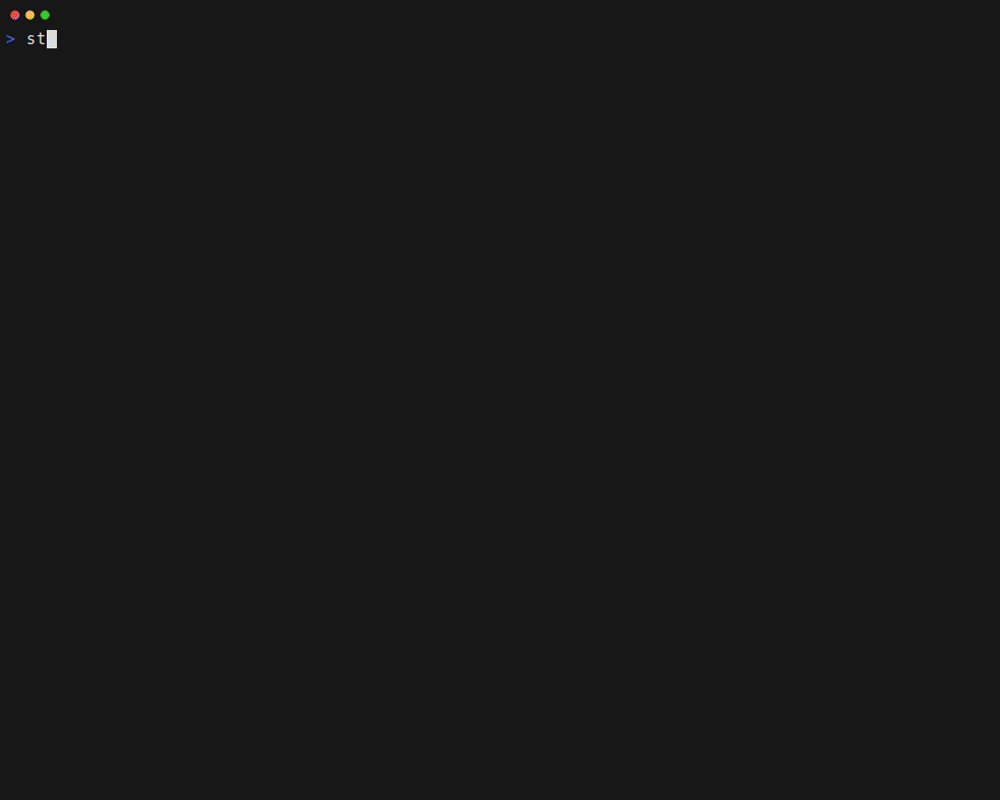

# stonks-cli

[](https://pypi.org/project/stonks-cli/)
[](https://pypi.org/project/stonks-cli/)
[](https://pypi.org/project/stonks-cli/)
[](https://pypi.org/project/stonks-cli/)
[](https://github.com/igoropaniuk/stonks-cli/actions)
[](https://codecov.io/gh/igoropaniuk/stonks-cli)
[](https://github.com/igoropaniuk/stonks-cli/blob/main/LICENSE)
[](https://click.palletsprojects.com/)

Track your investment portfolio directly from the terminal.



**Quick start:**

```bash
pip install stonks-cli
stonks demo # create demo portfolio
```

**Features:**

- **Terminal dashboard (TUI)** -- live prices with auto-refresh
- **Extended-hours quotes** -- PRE / AH / CLS session labels for US equities
- **Candlestick chart screen** -- zoomable OHLC chart
- **News feed panel** -- per-symbol headlines
- **Stock detail screen** -- charts, earnings, analyst insights, key statistics
- **Backtesting** -- simulate historical portfolio performance vs. a benchmark
- **AI chat assistant** -- ask questions about your portfolio
- **Watchlist** -- track symbols without a position; dimmed in the dashboard
- **Cryptocurrency** -- `BTC-USD`-style symbols priced via CoinGecko
- **Multi-portfolio** -- side-by-side YAML files with multiple `-p` flags
- **Multi-currency** -- totals converted to a base currency using forex rates

## Table of Contents

- [Installation](#installation)
- [Portfolio configuration](#portfolio-configuration)
  - [File structure](#file-structure)
  - [Ticker symbols and exchange suffixes](#ticker-symbols-and-exchange-suffixes)
  - [Americas](#americas)
  - [Canada](#canada)
  - [Europe](#europe)
  - [Asia-Pacific](#asia-pacific)
  - [Cryptocurrency](#cryptocurrency)
  - [Examples](#examples)
- [Usage](#usage)
  - [Quick snapshot (stdout)](#quick-snapshot-stdout)
  - [Interactive dashboard (TUI)](#interactive-dashboard-tui)
  - [Add a position](#add-a-position)
  - [Remove a position](#remove-a-position)
  - [Manage cash](#manage-cash)
  - [List portfolios](#list-portfolios)
  - [Importing positions](#importing-positions)
- [Dashboard](#dashboard)
  - [Columns](#columns)
  - [Session labels](#session-labels)
  - [Keyboard shortcuts](#keyboard-shortcuts)
- [News feed](#news-feed)
- [Candlestick chart](#candlestick-chart)
  - [Time ranges](#time-ranges)
  - [Keyboard shortcuts](#keyboard-shortcuts-1)
- [Stock detail screen](#stock-detail-screen)
- [AI Chat](#ai-chat)
  - [Requirements](#requirements)
  - [Environment variables](#environment-variables)
  - [Usage](#usage-1)
  - [What the assistant can help with](#what-the-assistant-can-help-with)
- [Logging](#logging)
- [Running with Docker](#running-with-docker)
  - [Build the image](#build-the-image)
  - [Run the container](#run-the-container)
- [Backtesting](#backtesting)
- [Market analysis](#market-analysis)
- [Contributing](#contributing)
- [License](#license)

---

## Installation

**Requirements:** Python 3.11+

### [Homebrew](https://brew.sh/) (macOS / Linux)

```bash
brew tap igoropaniuk/tap
brew install stonks-cli
```

### [pip](https://pip.pypa.io/)

```bash
pip install stonks-cli
```

### [pipx](https://pipx.pypa.io/) (recommended -- keeps the tool isolated)

```bash
pipx install stonks-cli
```

### [uv](https://docs.astral.sh/uv/)

```bash
uv tool install stonks-cli
```

## Portfolio configuration

stonks-cli stores your portfolio in a YAML file. By default the file is read
from `~/.config/stonks/portfolio.yaml`; you can override this with the
`-p` / `--portfolio` option (see [Usage](#usage)).

> **Try it first:** run `stonks demo` to explore the dashboard with a sample
> portfolio created in the system temporary directory. Your own portfolio at
> `~/.config/stonks/portfolio.yaml` is never touched.

### File structure

```yaml
portfolio:
  positions:
    - symbol: AAPL
      quantity: 10
      avg_cost: 150.00
      currency: USD

    - symbol: ASML.AS
      quantity: 5
      avg_cost: 680.00
      currency: EUR

    - symbol: 7203.T
      quantity: 100
      avg_cost: 1850.00
      currency: JPY

    - symbol: BTC-USD
      quantity: 0.5
      avg_cost: 60000.00
      currency: USD
      asset_type: crypto
      external_id: bitcoin

  cash:
    - currency: USD
      amount: 4250.00

    - currency: EUR
      amount: 2100.00

  watchlist:
    - symbol: TSLA
    - symbol: NVDA
    - symbol: LINK-USD
      asset_type: crypto
      external_id: chainlink
```

**Positions** fields:

| Field         | Type          | Required | Description                                                  |
| ------------- | ------------- | -------- | ------------------------------------------------------------ |
| `symbol`      | string        | yes      | Yahoo Finance ticker (case-insensitive); use `BASE-USD` for crypto |
| `quantity`    | int \| float  | yes      | Units held; fractional values supported for crypto           |
| `avg_cost`    | float         | yes      | Average cost per unit (positive)                             |
| `currency`    | string        | no       | ISO 4217 code; defaults to `USD`                             |
| `asset_type`  | string        | no       | Asset class: `equity`, `crypto`, `etf`, `bond`, `commodity`, `forex` |
| `external_id` | string        | no       | Provider-specific ID used for price lookup  |

**Cash** fields:

| Field      | Type   | Required | Description |
| ---------- | ------ | -------- | --------------------------------- |
| `currency` | string | yes      | ISO 4217 code (e.g. `USD`, `EUR`) |
| `amount`   | float  | yes      | Cash held (positive) |

**Watchlist** fields:

| Field         | Type   | Required | Description                                                       |
| ------------- | ------ | -------- | ----------------------------------------------------------------- |
| `symbol`      | string | yes      | Yahoo Finance ticker (case-insensitive); use `BASE-USD` for crypto |
| `asset_type`  | string | no       | Same values as positions; set to `crypto` for CoinGecko routing   |
| `external_id` | string | no       | CoinGecko coin ID (or other provider ID) for unambiguous lookup   |

Watchlist items are displayed in the dashboard with a dimmed style and only
show the live price and daily change -- they have no quantity, cost, or market
value and are **not included** in the portfolio total. Press Enter on a
watchlist row to open the detail screen.

> The file is created and updated automatically when you use the `add`,
> `remove`, `add-cash`, and `remove-cash` commands, so you only need to
> create it manually if you prefer to seed your data by hand.

### Ticker symbols and exchange suffixes

Yahoo Finance uses a dot-suffix convention to identify non-US exchanges.
Append the appropriate suffix to the base ticker symbol.

### Americas

| Suffix   | Exchange                    | Country   |
| -------- | --------------------------- | --------- |
| *(none)* | NYSE / NASDAQ / AMEX        | USA       |
| `.SA`    | B3 (São Paulo)              | Brazil    |
| `.BA`    | Buenos Aires Stock Exchange | Argentina |
| `.MX`    | Bolsa Mexicana de Valores   | Mexico    |
| `.SN`    | Santiago Stock Exchange     | Chile     |
| `.LIM`   | Lima Stock Exchange         | Peru      |

### Canada

| Suffix | Exchange               | Country |
| ------ | ---------------------- | ------- |
| `.TO`  | Toronto Stock Exchange | Canada  |
| `.V`   | TSX Venture Exchange   | Canada  |

### Europe

| Suffix | Exchange                 | Country     |
| ------ | ------------------------ | ----------- |
| `.L`   | London Stock Exchange    | UK          |
| `.PA`  | Euronext Paris           | France      |
| `.AS`  | Euronext Amsterdam       | Netherlands |
| `.BR`  | Euronext Brussels        | Belgium     |
| `.LS`  | Euronext Lisbon          | Portugal    |
| `.MI`  | Borsa Italiana           | Italy       |
| `.DE`  | XETRA                    | Germany     |
| `.F`   | Frankfurt Stock Exchange | Germany     |
| `.SW`  | SIX Swiss Exchange       | Switzerland |
| `.ST`  | Nasdaq Stockholm         | Sweden      |
| `.HE`  | Nasdaq Helsinki          | Finland     |
| `.CO`  | Nasdaq Copenhagen        | Denmark     |
| `.OL`  | Oslo Børs                | Norway      |
| `.WA`  | Warsaw Stock Exchange    | Poland      |
| `.AT`  | Athens Stock Exchange    | Greece      |

### Asia-Pacific

| Suffix  | Exchange                       | Country     |
| ------- | ------------------------------ | ----------- |
| `.AX`   | Australian Securities Exchange | Australia   |
| `.NZ`   | New Zealand Exchange           | New Zealand |
| `.HK`   | Hong Kong Stock Exchange       | Hong Kong   |
| `.T`    | Tokyo Stock Exchange           | Japan       |
| `.KS`   | Korea Exchange (KOSPI)         | South Korea |
| `.KQ`   | KOSDAQ                         | South Korea |
| `.TW`   | Taiwan Stock Exchange          | Taiwan      |
| `.TWO`  | Taiwan OTC                     | Taiwan      |
| `.SS`   | Shanghai Stock Exchange        | China       |
| `.SZ`   | Shenzhen Stock Exchange        | China       |
| `.NS`   | National Stock Exchange        | India       |
| `.BO`   | Bombay Stock Exchange          | India       |
| `.JK`   | Indonesia Stock Exchange       | Indonesia   |
| `.SI`   | Singapore Exchange             | Singapore   |
| `.KL`   | Bursa Malaysia                 | Malaysia    |
| `.BK`   | Stock Exchange of Thailand     | Thailand    |
| `.VN`   | Ho Chi Minh Stock Exchange     | Vietnam     |

### Cryptocurrency

Crypto symbols follow Yahoo Finance's `BASE-QUOTE` convention (e.g. `BTC-USD`).
Prices are fetched from the **CoinGecko public API** instead of Yahoo Finance.
No API key is required; set `COINGECKO_DEMO_API_KEY` in your environment to
use a Demo key for higher rate limits.

Set `asset_type: crypto` and provide an `external_id` (the CoinGecko coin ID)
for each crypto position or watchlist item. The `external_id` disambiguates
symbols that map to multiple coins and avoids a runtime search API call.

| Name      | Yahoo Finance symbol | CoinGecko `external_id` |
| --------- | -------------------- | ----------------------- |
| Bitcoin   | `BTC-USD`            | `bitcoin`               |
| Ethereum  | `ETH-USD`            | `ethereum`              |
| Solana    | `SOL-USD`            | `solana`                |
| Cardano   | `ADA-USD`            | `cardano`               |
| Dogecoin  | `DOGE-USD`           | `dogecoin`              |
| Polygon   | `MATIC-USD`          | `matic-network`         |
| Chainlink | `LINK-USD`           | `chainlink`             |
| Uniswap   | `UNI-USD`            | `uniswap`               |

If `external_id` is omitted, stonks-cli resolves the coin automatically using
a bundled symbol map (11 000+ entries) and falls back to the CoinGecko
`/search` endpoint for ambiguous symbols, ranked by market cap.

### Examples

| Symbol       | Instrument                |
| ------------ | ------------------------- |
| `AAPL`       | Apple (NASDAQ)            |
| `ASML.AS`    | ASML (Euronext Amsterdam) |
| `7203.T`     | Toyota (Tokyo SE)         |
| `HSBA.L`     | HSBC (London SE)          |
| `005930.KS`  | Samsung (KOSPI)           |
| `BTC-USD`    | Bitcoin / USD             |
| `ETH-USD`    | Ethereum / USD            |

---

## Usage

```text
stonks [OPTIONS] COMMAND [ARGS]...

Options:
  -p, --portfolio PATH                    Portfolio YAML file or name
                                          (repeatable; default:
                                          ~/.config/stonks/portfolio.yaml)
  --log-level [DEBUG|INFO|WARNING|ERROR]  Log verbosity written to the log
                                          file  [default: WARNING]
  -V, --version                           Show the version and exit.
  --help                                  Show this message and exit.

Commands:
  add         Add QUANTITY shares of SYMBOL at PRICE to the portfolio.
  remove      Remove QUANTITY shares of SYMBOL from the portfolio.
  add-cash    Add AMOUNT of CURRENCY cash to the portfolio.
  remove-cash Remove AMOUNT of CURRENCY cash from the portfolio.
  show        Print a snapshot of portfolio positions with current prices to stdout.
  dashboard   Display the current portfolio with live prices and P&L.
  list        List all portfolios in ~/.config/stonks/.
  demo        Launch the TUI with a sample portfolio (your portfolio is untouched).
  feed        Print the latest news headlines for a symbol to stdout.
  detail      Print a financial summary for a symbol to stdout.
  import      Import positions from a broker export (subcommands: ibkr).
```

### Quick snapshot (stdout)

Print the current portfolio state with live prices to stdout and exit:

```bash
# One-shot table output (no TUI)
stonks show

# With a specific portfolio
stonks -p work show
```

The output includes the same columns as the dashboard (Instrument, Exchange,
Qty, Avg Cost, Last Price, Daily Chg, Daily Chg %, Mkt Value, Unrealized P&L)
plus a Total line.
Session badges (PRE/AH/CLS) are appended to the last price when applicable.
If a price cannot be fetched, `N/A` is shown instead.

### Interactive dashboard (TUI)

Running `stonks` without a subcommand launches the dashboard automatically.
Prices refresh every **60 seconds** by default.

```bash
# Launch the TUI (dashboard is the default command)
stonks

# Equivalent -- explicit subcommand
stonks dashboard

# Refresh prices every 30 seconds instead
stonks dashboard --refresh 30

# Open two portfolios side by side
stonks -p personal -p work
```

### Add a position

```bash
# Add 10 shares of Apple at $150.00
stonks add AAPL 10 150.00

# Add a non-US stock (ASML on Euronext Amsterdam)
stonks add ASML.AS 5 680.00

# Add crypto (symbol is resolved automatically via the bundled coin map)
stonks add BTC-USD 0.5 60000.00

# For precise control, set external_id directly in the YAML:
#   external_id: bitcoin

# Use a named portfolio (resolves to ~/.config/stonks/work.yaml)
stonks -p work add NVDA 2 800.00
```

When a symbol is added a second time, the quantity is increased and the
average cost is recalculated as a weighted average automatically.

### Remove a position

```bash
# Remove 5 shares (partial close)
stonks remove AAPL 5

# Remove all shares (position deleted)
stonks remove AAPL 10
```

### Manage cash

```bash
# Deposit cash
stonks add-cash USD 5000.00
stonks add-cash EUR 2000.00

# Withdraw cash (partial)
stonks remove-cash USD 500.00

# Withdraw all remaining cash of a currency (position deleted)
stonks remove-cash EUR 2000.00
```

Cash is displayed in the dashboard below the stock positions and is included
in the total portfolio value converted to the base currency.

### List portfolios

```bash
stonks list
```

Lists all `.yaml` files found in `~/.config/stonks/`.

### Importing positions

Positions can be bulk-imported from broker exports instead of being added one
by one.

| Broker | Command | Guide |
|---|---|---|
| Interactive Brokers | `stonks import ibkr positions.csv` | [docs/import/interactive-brokers.md](docs/import/interactive-brokers.md) |

---

## Dashboard

### Columns

| Column         | Description                                                          |
| -------------- | -------------------------------------------------------------------- |
| Instrument     | Ticker symbol                                                        |
| Exchange       | Exchange name derived from ticker suffix (e.g. NYSE/NASDAQ, Crypto)  |
| Qty            | Number of shares held                                                |
| Avg Cost       | Average purchase price per share                                     |
| Last Price     | Most recent price; tagged PRE, AH, or CLS for non-regular sessions   |
| Daily Chg      | Absolute price change vs. the previous close (green / red)           |
| Daily Chg %    | Percentage change vs. the previous close (green / red)               |
| Mkt Value      | Current market value (Qty * Last Price)                              |
| Unrealized P&L | Profit/loss vs. average cost (bold green / bold red)                 |

Both daily change columns show `--` for closed-session tickers (CLS).

A **Total** line at the bottom converts all positions and cash to the
portfolio's base currency using live forex rates.

Watchlist rows are dimmed and only show Instrument, Exchange, Last Price, and
Daily Chg columns -- all other columns display `--`.

Column widths are distributed proportionally and reflow automatically when
the terminal is resized.

### Session labels

US equities on exchanges that support extended hours show a session tag next
to the price:

| Tag   | Session                   |
| ----- | ------------------------- |
| `PRE` | Pre-market                |
| `AH`  | After-hours / post-market |
| `CLS` | Market closed             |
| *(none)* | Regular trading hours  |

Non-US equities and crypto show no tag during regular hours and `CLS` when the
market is closed (using holiday-aware calendar data).

### Keyboard shortcuts

| Key      | Action                                            |
| -------- | ------------------------------------------------- |
| `a`      | Add a new position (equity, crypto, ETF, cash)    |
| `e`      | Edit the currently selected position              |
| `r`      | Remove the currently selected position            |
| `Enter`  | Open the detail screen for the selected row       |
| `f`      | Open the detail screen for the selected row       |
| `g`      | Open the candlestick chart for the selected row   |
| `Tab`    | Switch focus between portfolio tables             |
| `c`      | Open the AI chat assistant                        |
| `b`      | Run a portfolio backtest                          |
| `n`      | Toggle the news feed panel                        |
| `l`      | Open the log viewer                               |
| `q`      | Quit                                              |

Column headers are clickable -- click once to sort ascending, again to sort
descending.

---

## News feed

Press **`n`** from the dashboard to toggle the news feed panel. It shows the
most recent headlines across all your portfolio symbols and watchlist items,
sourced from Yahoo Finance. Articles older than 3 days are filtered out
automatically.

Each row shows the publication time, symbol, headline, and source. Click a
headline to open it in your browser.

---

## Candlestick chart

Press **`g`** on any equity or watchlist row to open an interactive OHLC
candlestick chart directly in the terminal. Press **Escape** or **Q** to
return to the dashboard.

### Time ranges

| Label    | Period | Interval |
| -------- | ------ | -------- |
| `1D 1m`  | 1 day  | 1 minute  |
| `1D 2m`  | 1 day  | 2 minutes |
| `5D 5m`  | 5 days | 5 minutes |
| `1M 15m` | 1 month | 15 minutes |
| `3M 1h`  | 3 months | 1 hour  |
| `6M 1d`  | 6 months | 1 day   |
| `1Y 1d`  | 1 year  | 1 day   |
| `5Y 1wk` | 5 years | 1 week  |

The default view opens at **5D 5m**.

### Keyboard shortcuts

| Key          | Action                                 |
| ------------ | -------------------------------------- |
| `Left`       | Move cursor to the previous candle     |
| `Right`      | Move cursor to the next candle         |
| `Home`       | Jump to the first (oldest) candle      |
| `End`        | Jump to the last (newest) candle       |
| `+` / `=`    | Zoom in (narrower interval)            |
| `-` / `_`    | Zoom out (wider interval)              |
| `Up`         | Expand Y-axis range                    |
| `Down`       | Narrow Y-axis range                    |
| `Escape` / `Q` | Close and return to the dashboard    |

When you reach the leftmost or rightmost candle, the chart automatically
prefetches older or newer data so you can scroll continuously through history.
Zooming recentres on the candle under the cursor.

---

## Stock detail screen

Press **Enter** on any equity or watchlist row to open a full-screen detail
view. Press **Escape** or **Q** to return to the dashboard.

The detail screen displays:

- **Performance** -- trailing returns (YTD, 1Y, 3Y, 5Y) compared side-by-side
  with the S&P 500
- **Price charts** -- interactive terminal charts for 1 Day, 1 Month, 1 Year,
  and 5 Years
- **Financial summary** -- previous close, open, bid/ask, day range, 52-week
  range, volume, market cap, P/E, EPS, earnings date, dividend yield
- **Earnings trends** -- quarterly EPS actual vs. estimate bar chart; revenue
  vs. net income chart
- **Analyst insights** -- price targets (low / mean / high), consensus rating,
  and a monthly recommendations breakdown (Strong Buy to Strong Sell)
- **Statistics** -- valuation measures and financial highlights

---

## AI Chat

Press **`c`** from the dashboard to open the AI chat assistant. The assistant
has access to your live portfolio snapshot, current prices, forex rates, and
recent news headlines, so it can answer questions grounded in your actual data.

### Requirements

Set the `OPENAI_API_KEY` environment variable before starting stonks:

```bash
export OPENAI_API_KEY=sk-...
stonks
```

The input field is disabled with an error message if the key is missing or if
live prices have not yet loaded.

### Environment variables

| Variable          | Default        | Description                                      |
| ----------------- | -------------- | ------------------------------------------------ |
| `OPENAI_API_KEY`  | *(required)*   | Your OpenAI API key                              |
| `OPENAI_MODEL`    | `gpt-5.4-mini` | Model to use for chat completions                |
| `OPENAI_BASE_URL` | *(OpenAI)*     | Override the API endpoint (proxies, local LLMs)  |

`OPENAI_BASE_URL` is useful for pointing the client at any OpenAI-compatible
server -- for example [Ollama](https://ollama.com), LM Studio, or a corporate
proxy:

```bash
export OPENAI_BASE_URL=http://localhost:11434/v1
export OPENAI_MODEL=llama3
stonks
```

### Usage

- Type a question in the input field and press **Enter** to send.
- The assistant streams the reply as Markdown directly in the chat log.
- Previous messages are kept in context within the session.
- Press **Escape** to close the chat and return to the dashboard.

### What the assistant can help with

- Portfolio breakdown -- positions, P&L, concentration risk
- Market context -- connecting recent headlines to your holdings
- App usage -- how to load portfolios, configure watchlists, use the CLI

The assistant will not invent prices, news, or ratings. If data is unavailable
it will say so explicitly.

---

## Logging

stonks-cli writes structured log messages to a platform-specific file:

| Platform | Path                                          |
| -------- | --------------------------------------------- |
| Linux    | `~/.local/state/stonks/log/stonks.log`        |
| macOS    | `~/Library/Logs/stonks/stonks.log`            |
| Windows  | `%LOCALAPPDATA%\stonks\Logs\stonks.log`       |

The default verbosity is `WARNING` (only warnings and errors are recorded).
Use `--log-level` to capture more detail:

```bash
# Capture all debug output
stonks --log-level DEBUG

# Capture info and above
stonks --log-level INFO dashboard --refresh 30
```

Log entries follow the format:

```text
YYYY-MM-DDTHH:MM:SS  LEVEL     logger_name  message
```

---

## Running with Docker

### Build the image

```bash
docker build -t stonks .
```

### Run the container

```bash
docker run --rm -it \
  -v ./config/sample_portfolio.yaml:/data/portfolio.yaml:ro \
  stonks --portfolio /data/portfolio.yaml dashboard
```

The `-v` flag bind-mounts a local YAML file into the container. Replace
`./config/sample_portfolio.yaml` with the path to your own portfolio file.
Drop `:ro` if you want `add` / `remove` commands to persist changes back to
the host.

---

## Backtesting

Press **`b`** from the dashboard to open the backtest configuration form.
Backtesting simulates how your portfolio's current allocation would have
performed over a historical period, compared against a benchmark index.

### Configuration

| Field            | Default | Description                                            |
| ---------------- | ------- | ------------------------------------------------------ |
| Benchmark Symbol | `SPY`   | Ticker to compare against (e.g. `SPY`, `QQQ`, `VT`)   |
| Starting Amount  | `10000` | Initial investment amount in USD                       |
| Start Year       | `2010`  | First year of the simulation                           |
| End Year         | current | Last year of the simulation                            |
| Yearly Cashflows | `0`     | Additional amount contributed each year                |
| Rebalancing      | none    | `none`, `monthly`, or `annual` rebalancing strategy    |
| Skip unavailable | on      | Skip positions without historical data for the period  |

The portfolio's current allocation weights are held constant throughout the
simulation. Historical prices are fetched from Yahoo Finance.

### Results

The backtest results screen displays:

- **Portfolio Growth chart** -- cumulative value of the portfolio vs. the
  benchmark over the full period
- **Annual Returns chart** -- side-by-side grouped bar chart showing yearly
  returns for the portfolio and benchmark, with annotated values
- **Summary statistics** -- CAGR, max drawdown, Sharpe ratio, best/worst year,
  and final portfolio value for both the portfolio and the benchmark

If any position symbols lack historical data for the requested start year and
**Skip unavailable** is unchecked, an error message is shown with the earliest
available date for each symbol. When the checkbox is enabled (the default),
those positions are excluded automatically and their weights are redistributed
among the remaining symbols. Skipped positions are listed at the top of the
results screen. The benchmark symbol is always required regardless of this
setting.

Press **Escape** or **Q** to return to the dashboard.

---

## Market analysis


Looks bullish.

## Contributing

Contributions are welcome! Please read [CONTRIBUTING.md](CONTRIBUTING.md) for
development setup, coding style, commit message conventions, and the pull
request workflow.

For the release process, see [RELEASING.md](RELEASING.md).

---

## License

MIT License. See [LICENSE](LICENSE) for details.
