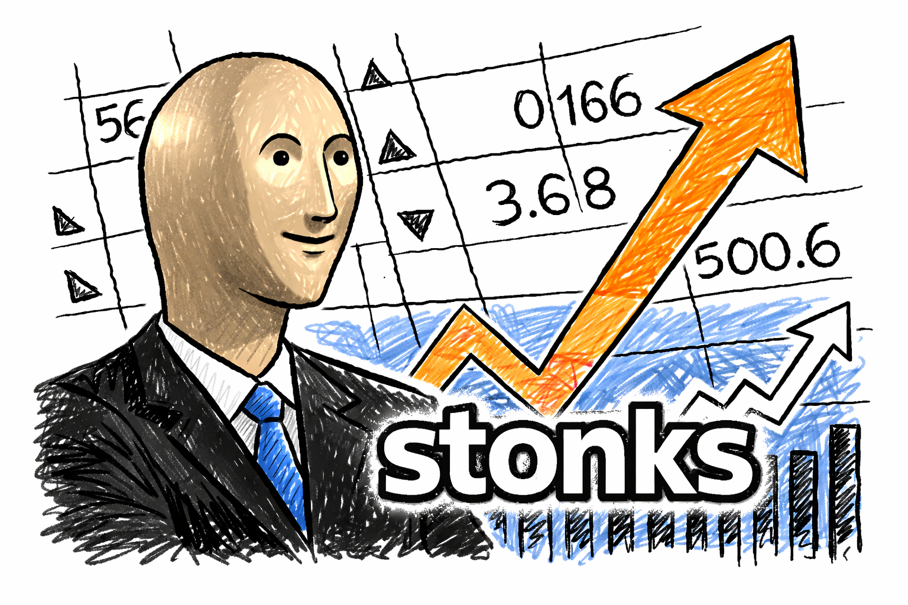

# stonks-cli



A terminal-based investment portfolio tracker. Displays your holdings with live
market prices, unrealized P&L, and a total portfolio value converted to USD —
all in a full-screen TUI that refreshes automatically.

---

## Prerequisites

- **Python 3.11+**
- **Poetry** — [installation guide](https://python-poetry.org/docs/#installation)
- An internet connection (prices are fetched from Yahoo Finance via
  [yfinance](https://github.com/ranaroussi/yfinance))

---

## Fetching the project

```bash
git clone https://github.com/igorpaniuk/stonks-cli.git
cd stonks-cli
```

---

## Preparing configuration in YAML format

stonks-cli stores your portfolio in a YAML file.  By default the file is read
from `~/.config/stonks/portfolio.yaml`; you can override this with the
`-p` / `--portfolio` option (see [Usage](#usage)).

### File structure

```yaml
portfolio:
  positions:
    - symbol: AAPL
      quantity: 10
      avg_cost: 150.00
      currency: USD

    - symbol: ASML.AS
      quantity: 5
      avg_cost: 680.00
      currency: EUR

    - symbol: 7203.T
      quantity: 100
      avg_cost: 1850.00
      currency: JPY
```

| Field      | Type   | Required | Description                             |
| ---------- | ------ | -------- | --------------------------------------- |
| `symbol`   | string | yes      | Yahoo Finance ticker (case-insensitive) |
| `quantity` | int    | yes      | Shares held (positive integer)          |
| `avg_cost` | float  | yes      | Average cost per share (positive)       |
| `currency` | string | no       | ISO 4217 code; defaults to `USD`        |

> The file is created and updated automatically when you use the `add` and
> `remove` commands, so you only need to create it manually if you prefer to
> seed your positions by hand.

### Ticker symbols and exchange suffixes

Yahoo Finance uses a dot-suffix convention to identify non-US exchanges.
Append the appropriate suffix to the base ticker symbol.

### Americas

| Suffix   | Exchange                    | Country   |
| -------- | --------------------------- | --------- |
| *(none)* | NYSE / NASDAQ / AMEX        | USA       |
| `.SA`    | B3 (São Paulo)              | Brazil    |
| `.BA`    | Buenos Aires Stock Exchange | Argentina |
| `.MX`    | Bolsa Mexicana de Valores   | Mexico    |
| `.SN`    | Santiago Stock Exchange     | Chile     |
| `.LIM`   | Lima Stock Exchange         | Peru      |

### Canada

| Suffix | Exchange               | Country |
| ------ | ---------------------- | ------- |
| `.TO`  | Toronto Stock Exchange | Canada  |
| `.V`   | TSX Venture Exchange   | Canada  |

### Europe

| Suffix | Exchange                 | Country     |
| ------ | ------------------------ | ----------- |
| `.L`   | London Stock Exchange    | UK          |
| `.PA`  | Euronext Paris           | France      |
| `.AS`  | Euronext Amsterdam       | Netherlands |
| `.BR`  | Euronext Brussels        | Belgium     |
| `.LS`  | Euronext Lisbon          | Portugal    |
| `.MI`  | Borsa Italiana           | Italy       |
| `.DE`  | XETRA                    | Germany     |
| `.F`   | Frankfurt Stock Exchange | Germany     |
| `.SW`  | SIX Swiss Exchange       | Switzerland |
| `.ST`  | Nasdaq Stockholm         | Sweden      |
| `.HE`  | Nasdaq Helsinki          | Finland     |
| `.CO`  | Nasdaq Copenhagen        | Denmark     |
| `.OL`  | Oslo Børs                | Norway      |
| `.WA`  | Warsaw Stock Exchange    | Poland      |
| `.AT`  | Athens Stock Exchange    | Greece      |

### Asia-Pacific

| Suffix  | Exchange                       | Country     |
| ------- | ------------------------------ | ----------- |
| `.AX`   | Australian Securities Exchange | Australia   |
| `.NZ`   | New Zealand Exchange           | New Zealand |
| `.HK`   | Hong Kong Stock Exchange       | Hong Kong   |
| `.T`    | Tokyo Stock Exchange           | Japan       |
| `.KS`   | Korea Exchange (KOSPI)         | South Korea |
| `.KQ`   | KOSDAQ                         | South Korea |
| `.TW`   | Taiwan Stock Exchange          | Taiwan      |
| `.TWO`  | Taiwan OTC                     | Taiwan      |
| `.SS`   | Shanghai Stock Exchange        | China       |
| `.SZ`   | Shenzhen Stock Exchange        | China       |
| `.NS`   | National Stock Exchange        | India       |
| `.BO`   | Bombay Stock Exchange          | India       |
| `.JK`   | Indonesia Stock Exchange       | Indonesia   |
| `.SI`   | Singapore Exchange             | Singapore   |
| `.KL`   | Bursa Malaysia                 | Malaysia    |
| `.BK`   | Stock Exchange of Thailand     | Thailand    |
| `.VN`   | Ho Chi Minh Stock Exchange     | Vietnam     |

### Examples

| Symbol       | Instrument                |
| ------------ | ------------------------- |
| `AAPL`       | Apple (NASDAQ)            |
| `ASML.AS`    | ASML (Euronext Amsterdam) |
| `7203.T`     | Toyota (Tokyo SE)         |
| `HSBA.L`     | HSBC (London SE)          |
| `005930.KS`  | Samsung (KOSPI)           |

---

## Installing and running the project with Poetry

### Install dependencies

```bash
poetry install
```

### Usage

```text
stonks [OPTIONS] COMMAND [ARGS]...

Options:
  -p, --portfolio PATH  Portfolio YAML file
                        (default: ~/.config/stonks/portfolio.yaml)
  --help                Show this message and exit.

Commands:
  add     Add QUANTITY shares of SYMBOL at PRICE to the portfolio.
  remove  Remove QUANTITY shares of SYMBOL from the portfolio.
  show    Display the current portfolio with live prices and P&L.
```

#### Add a position

```bash
# Add 10 shares of Apple at $150.00
poetry run stonks add AAPL 10 150.00

# Add a non-US stock (ASML on Euronext Amsterdam)
poetry run stonks add ASML.AS 5 680.00

# Use a custom portfolio file
poetry run stonks -p ~/my-portfolio.yaml add NVDA 2 800.00
```

When a symbol is added a second time, the quantity is increased and the average
cost is recalculated as a weighted average automatically.

#### Remove a position

```bash
# Remove 5 shares (partial close)
poetry run stonks remove AAPL 5

# Remove all shares (position deleted)
poetry run stonks remove AAPL 10
```

#### Show the portfolio

```bash
# Launch the TUI with the default 5-second refresh
poetry run stonks show

# Refresh prices every 30 seconds
poetry run stonks show --refresh 30
```

The TUI displays a table with the following columns:

| Column         | Description                                  |
| -------------- | -------------------------------------------- |
| Instrument     | Ticker symbol                                |
| Qty            | Number of shares held                        |
| Avg Cost       | Average purchase price per share             |
| Last Price     | Most recent closing price from Yahoo Finance |
| Mkt Value      | Current market value (Qty × Last Price)      |
| Unrealized P&L | Profit/loss vs. average cost (green/red)     |

A **Total (USD)** line at the bottom converts all positions to USD using live
forex rates and sums them up.

Press `q` to quit.

*Screenshot uses the sample portfolio from
[config/sample_portfolio.yaml](config/sample_portfolio.yaml) — all
positions and costs are fictitious test data.*


---

## Running with Docker

### Build the image

```bash
docker build -t stonks .
```

### Run the container

```bash
docker run --rm -it \
  -v ./config/sample_portfolio.yaml:/data/portfolio.yaml:ro \
  stonks --portfolio /data/portfolio.yaml show
```

The `-v` flag bind-mounts a local YAML file into the container. Replace
`./config/sample_portfolio.yaml` with the path to your own portfolio file.
Drop `:ro` if you want `add` / `remove` commands to persist changes back to
the host.

---

## License

MIT License. See [LICENSE](LICENSE) for details.
