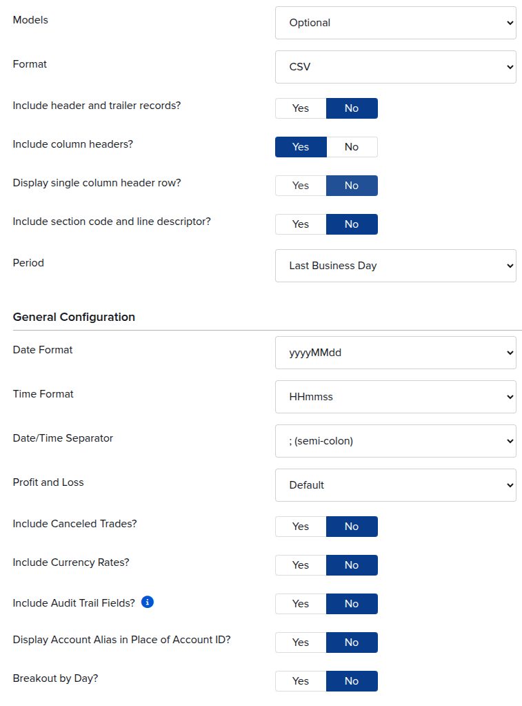
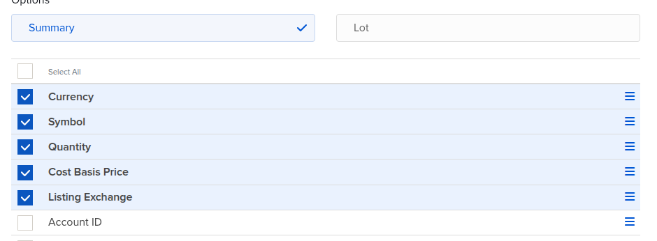
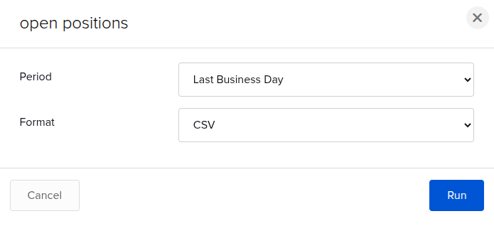

# Importing from Interactive Brokers (IBKR)

stonks-cli can import portfolio positions directly from an Interactive Brokers
Flex Query CSV export.

## Quick start

```sh
stonks import ibkr positions.csv
```

To import into a named portfolio:

```sh
stonks -p work import ibkr positions.csv
```

If the target portfolio already contains positions, you will be asked to
confirm before they are replaced.

---

## Exporting from IBKR

### 1. Log in to Client Portal

Go to [www.interactivebrokers.com](https://www.interactivebrokers.com/)
and sign in.

### 2. Open Flex Queries

Navigate to **Performance & Reports -> Flex Queries**.

### 3. Create a new Activity Flex Query

Click **Create** (or the **+** icon) next to *Activity Flex Query*.

Give the query a name, e.g. `stonks-positions`.

Configure the query with **Format: CSV** and **Period: Last Business Day**:



### 4. Add the Open Positions section

Under **Sections**, click **Open Positions** to expand it and enable it.

Select (at minimum) the following fields:

| Field           | Notes                                          |
|-----------------|------------------------------------------------|
| Symbol          | Ticker symbol -- **required**                  |
| Quantity        | Share quantity -- **required**                 |
| Cost Basis Price| Average cost per share -- **required**         |
| Currency        | Position currency (defaults to USD if absent)  |
| Listing Exchange| Exchange the instrument is listed on           |

You may select additional fields (Description, MarkPrice, etc.) -- they are
ignored during import.



### 5. Save and run the query

Click **Save**, then **Run** the query. In the run dialog set **Format** to
**CSV** (not XML):



### 6. Export as CSV

When the results appear, download the file -- it will be in CSV format.

---

## What gets imported

- Only **equity** rows (`AssetClass = STK`) are imported.
- Rows with a zero or negative `Position` (short positions, expired
  instruments) are skipped automatically.
- The `currency` field defaults to `USD` when the `CurrencyPrimary` /
  `Currency` column is absent.

The following are **not** imported in the current version and will be
silently skipped:

- Options (`OPT`)
- Futures (`FUT`)
- Forex positions (`CASH`)
- Bonds, warrants, and other asset classes

---

## Example

See [`example_ibkr_positions.csv`](example_ibkr_positions.csv) for a
sample file in plain CSV format that you can use to test the import.

```sh
stonks import ibkr docs/import/example_ibkr_positions.csv
```

Expected output:

```text
+ Imported 8 position(s) from Interactive Brokers export
```
